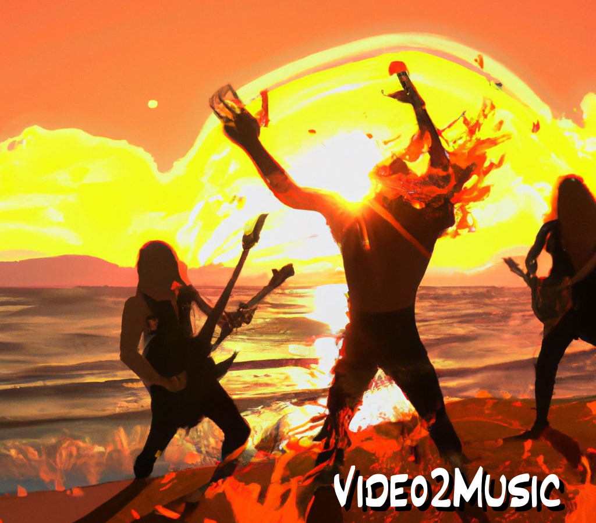
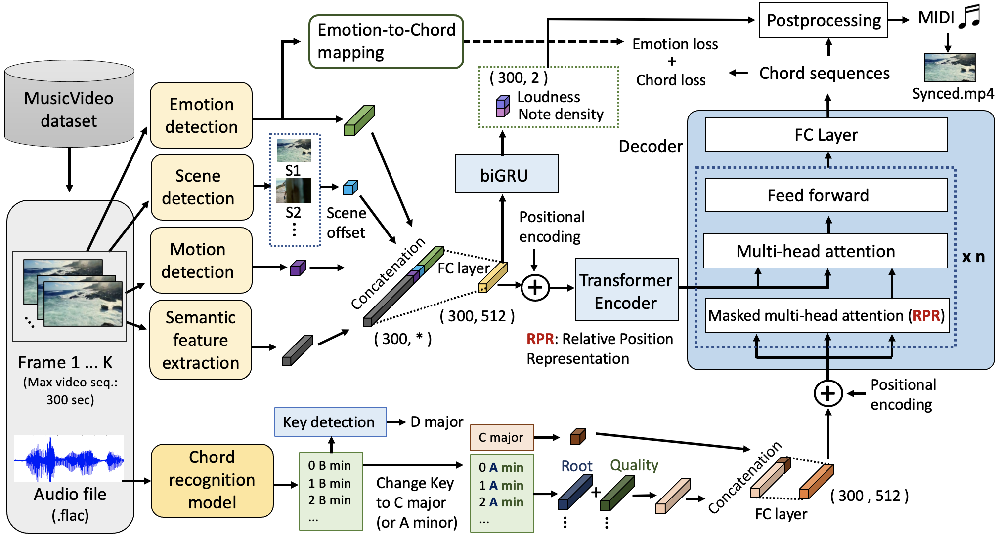

<div align="center">

# Video2Music: Suitable Music Generation from Videos using an Affective Multimodal Transformer model


[Demo](https://huggingface.co/spaces/amaai-lab/video2music) | [Website and Examples](https://amaai-lab.github.io/Video2Music/) | [Paper](https://doi.org/10.1016/j.eswa.2024.123640) | [Dataset (MuVi-Sync)](https://zenodo.org/records/10057093)

[](https://huggingface.co/spaces/amaai-lab/video2music)  [](https://arxiv.org/abs/2311.00968)

</div>

This repository contains the code and dataset accompanying the paper "Video2Music: Suitable Music Generation from Videos using an Affective Multimodal Transformer model" by Dr. Jaeyong Kang, Prof. Soujanya Poria, and Prof. Dorien Herremans.

🔥 Live demo available on [HuggingFace](https://huggingface.co/spaces/amaai-lab/video2music) and [Replicate](https://replicate.com/amaai-lab/video2music).

<div align="center">
  
</div>

## Introduction
We propose a novel AI-powered multimodal music generation framework called Video2Music. This framework uniquely uses video features as conditioning input to generate matching music using a Transformer architecture. By employing cutting-edge technology, our system aims to provide video creators with a seamless and efficient solution for generating tailor-made background music.




## Change Log
- 2023-11-28: add new input method (YouTube URL) on HuggingFace

## Quickstart Guide

Generate music from video:

```python
import IPython
from video2music import Video2music

input_video = "input.mp4"

input_primer = "C Am F G"
input_key = "C major"

video2music = Video2music()
output_filename = video2music.generate(input_video, input_primer, input_key)

IPython.display.Video(output_filename)
```

## Installation

This repo is developed using python version 3.8

```bash
apt-get update
apt-get install ffmpeg
apt-get install fluidsynth
git clone https://github.com/AMAAI-Lab/Video2Music
cd Video2Music
pip install -r requirements.txt
```

* Download the processed training data `AMT.zip` from [HERE](https://drive.google.com/file/d/1qpcBXF04pgdy9hqRexr0mTx7L9_CAFpt/view?usp=drive_link) and extract the zip file and put the extracted two files directly under this folder (`saved_models/AMT/`)

* Download the soundfont file `default_sound_font.sf2` from [HERE](https://drive.google.com/file/d/1B9qjgimW9h6Gg5k8PZNt_ArWwSMJ4WuJ/view?usp=drive_link) and put the file directly under this folder (`soundfonts/`)

* Our code is built on pytorch version 1.12.1 (torch==1.12.1 in the requirements.txt). But you might need to choose the correct version of `torch` based on your CUDA version

## Dataset

* Obtain the dataset:
  * MuVi-Sync [(Link)](https://zenodo.org/records/10057093)
 
* Put all directories started with `vevo` in the dataset under this folder (`dataset/`) 

## Directory Structure

* `saved_models/`: saved model files
* `utilities/`
  * `run_model_vevo.py`: code for running model (AMT)
  * `run_model_regression.py`: code for running model (bi-GRU)
* `model/`
  * `video_music_transformer.py`: Affective Multimodal Transformer (AMT) model 
  * `video_regression.py`: Bi-GRU regression model used for predicting note density/loudness
  * `positional_encoding.py`: code for Positional encoding
  * `rpr.py`: code for RPR (Relative Positional Representation)
* `dataset/`
  * `vevo_dataset.py`: Dataset loader
* `script/` : code for extracting video/music features (sementic, motion, emotion, scene offset, loudness, and note density)
* `train.py`: training script (AMT)
* `train_regression.py`: training script (bi-GRU)
* `evaluate.py`: evaluation script
* `generate.py`: inference script
* `video2music.py`: Video2Music module that outputs video with generated background music from input video
* `demo.ipynb`: Jupyter notebook for Quickstart Guide

## Training

  ```shell
  python train.py
  ```

## Inference

  ```shell
  python generate.py
  ```


## Subjective Evaluation by Listeners

| **Model** | **Overall Music Quality** ↑ | **Music-Video Correspondence** ↑ | **Harmonic Matching** ↑ | **Rhythmic Matching** ↑ | **Loudness Matching** ↑ |
|--------------------|:-----------:|:----------:|:----------:|:----------:|:----------:|
| Music Transformer  | 3.4905      | 2.7476     | 2.6333     | 2.8476     | 3.1286     |
| Video2Music        | 4.2095      | 3.6667     | 3.4143     | 3.8714     | 3.8143     |


## TODO

- [ ] Add other instruments (e.g., drum) for live demo

## Citation
If you find this resource useful, [please cite the original work](https://doi.org/10.1016/j.eswa.2024.123640):

```bibtex
@article{KANG2024123640,
  title = {Video2Music: Suitable music generation from videos using an Affective Multimodal Transformer model},
  author = {Jaeyong Kang and Soujanya Poria and Dorien Herremans},
  journal = {Expert Systems with Applications},
  pages = {123640},
  year = {2024},
  issn = {0957-4174},
  doi = {https://doi.org/10.1016/j.eswa.2024.123640},
}
```

Kang, J., Poria, S. & Herremans, D. (2024). Video2Music: Suitable Music Generation from Videos using an Affective Multimodal Transformer model, Expert Systems with Applications (in press).


## Acknowledgements

Our code is based on [Music Transformer](https://github.com/gwinndr/MusicTransformer-Pytorch).


